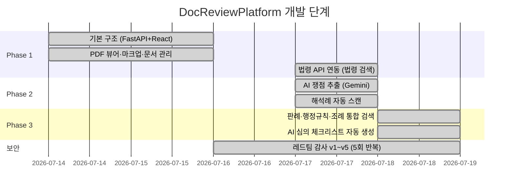
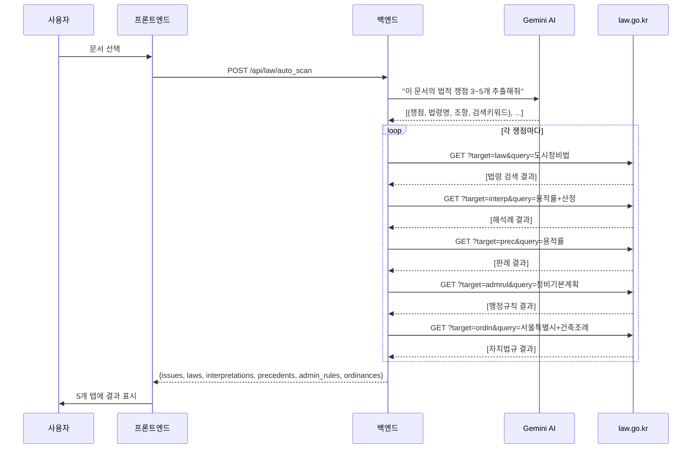
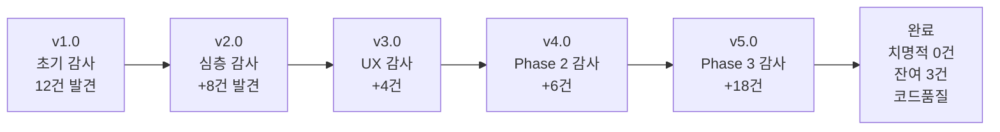

---json
{
  "id": 24,
  "title": "SOP 04: DocReviewPlatform 개발 교육 매뉴얼 — 건축 문서 통합 관리 플랫폼",
  "category": "🏗️ 플랫폼 개발 (개발자/DX)",
  "level": 3,
  "is_internal": false,
  "date": "2026-07-18",
  "summary": "FastAPI+React 기반의 건축 문서 검토 플랫폼(DocReviewPlatform)의 시스템 아키텍처, 개발 환경, 국가법령정보센터 API 연동, Gemini AI 통합, 레드팀 보안 감사 과정을 담은 개발자용 교육 매뉴얼"
}
---
# 📘 DocReviewPlatform 개발 교육 매뉴얼

> **작성자**: (주)진양엔지니어링건축사사무소 — 대표이사 김중일 / AI 에이전트 공동 개발  
> **작성일**: 2026-07-18 v1.0  
> **대상 독자**: 본 플랫폼의 구조를 이해하고 유지보수 또는 확장하려는 개발자  
> **난이도**: 중급 (Python/FastAPI + React/Vite 기초 지식 필요)

---

## 목차

1. [프로젝트 개요](#1-프로젝트-개요)
2. [시스템 아키텍처](#2-시스템-아키텍처)
3. [개발 환경 구성](#3-개발-환경-구성)
4. [백엔드 심층 해설](#4-백엔드-심층-해설)
5. [프론트엔드 심층 해설](#5-프론트엔드-심층-해설)
6. [국가법령정보센터 API 연동](#6-국가법령정보센터-api-연동)
7. [AI(Gemini) 연동 패턴](#7-aigemini-연동-패턴)
8. [보안 — 레드팀 감사 과정과 교훈](#8-보안--레드팀-감사-과정과-교훈)
9. [개선 로드맵](#9-개선-로드맵)
10. [부록: 자주 묻는 질문(FAQ)](#10-부록-자주-묻는-질문faq)

---

## 1. 프로젝트 개요

### 1.1 무엇을 만들었나?

**DocReviewPlatform**은 건축 설계 도서(PDF)를 브라우저에서 열고, AI(Google Gemini)가 자동으로 법규 위반 위험을 분석하며, 국가법령정보센터 API로 관련 법령·해석례·판례·조례를 실시간 조회하는 **건축 문서 통합 관리 플랫폼**입니다.

### 1.2 왜 만들었나?

| 기존 방식 (Before) | 플랫폼 도입 후 (After) |
|---|---|
| 수동으로 법령 검색 → 누락 위험 | AI가 문서에서 쟁점을 추출하고 법령을 자동 매칭 |
| 도면에 빨간펜 → 공유·보관 불편 | 브라우저에서 마크업 → 클라우드 저장 |
| 검토 의견서 수작업 작성 | AI 보조 + PDF 자동 추출 |
| 법규질의회신(해석례) 수동 검색 | 국가법령정보센터 API 자동 연동 |

### 1.3 개발 페이즈 요약



---

## 2. 시스템 아키텍처

### 2.1 전체 구조도

```
┌─────────────────────────────────────────────────────────────┐
│                     사용자 브라우저                            │
│  ┌─────────┐  ┌──────────┐  ┌──────────┐  ┌──────────────┐  │
│  │Sidebar  │  │PdfViewer │  │ReviewEdit│  │  LawPanel    │  │
│  │(문서목록)│  │(도면뷰어) │  │(검토편집) │  │ (법령 조회)  │  │
│  └────┬────┘  └────┬─────┘  └────┬─────┘  └──────┬───────┘  │
│       └──────────┬─┴────────────┬┘               │          │
│           DocumentContext (전역 상태)              │          │
└────────────────────┬──────────────────────────────┘          │
                     │ HTTP (fetch)                            │
┌────────────────────▼──────────────────────────────────────────┐
│                    FastAPI 백엔드 (:8080)                      │
│  ┌──────────┐  ┌──────────┐  ┌──────────┐  ┌─────────────┐   │
│  │documents │  │analysis  │  │projects  │  │  law.py     │   │
│  │.py       │  │.py       │  │.py       │  │ (법령 API)  │   │
│  └──────────┘  └────┬─────┘  └──────────┘  └──────┬──────┘   │
│                     │                             │           │
│              ┌──────▼──────┐              ┌───────▼────────┐  │
│              │ Gemini AI   │              │ law.go.kr API  │  │
│              │ (쟁점 추출)  │              │ (법령/판례/조례)│  │
│              └─────────────┘              └────────────────┘  │
└───────────────────────────────────────────────────────────────┘
```

### 2.2 기술 스택

| 계층 | 기술 | 버전 | 역할 |
|------|------|------|------|
| **프론트엔드** | React + Vite | 19.1 / 7.x | SPA UI 프레임워크 |
| **상태 관리** | React Context API | — | 전역 상태 (문서, 지역, 프로젝트) |
| **PDF 렌더링** | react-pdf (pdf.js) | 9.x | 브라우저 내 PDF 표시 |
| **PDF 생성** | html2pdf.js | 0.14 | 검토 보고서 → PDF 변환 |
| **백엔드** | FastAPI (Python) | 0.139 | REST API 서버 |
| **AI 엔진** | Google Gemini | 3.5-flash | 법적 쟁점 추출, 체크리스트 생성 |
| **외부 API** | 국가법령정보센터 | — | 법령, 해석례, 판례, 조례 검색 |
| **인증** | Google OAuth 2.0 | — | 사용자 로그인 |

### 2.3 폴더 구조

```
DocReviewPlatform/
├── .env                          ← 환경변수 (API 키, OAuth 시크릿)
├── .env.example                  ← 템플릿 (배포 시 참고)
├── run.sh                        ← 원클릭 실행 스크립트
│
├── backend/                      ← FastAPI 서버
│   ├── main.py                   ← 앱 초기화, 미들웨어 설정
│   ├── requirements.txt          ← Python 패키지 목록
│   ├── core/
│   │   ├── law_search.py         ← 국가법령정보센터 API 래퍼
│   │   ├── legal_db.py           ← 지역별 법규 DB 경로 관리
│   │   └── storage.py            ← 파일 저장소 경로 상수
│   └── routers/
│       ├── analysis.py           ← AI 분석 (Gemini) 엔드포인트
│       ├── documents.py          ← 문서 CRUD 엔드포인트
│       ├── law.py                ← 법령 검색 엔드포인트
│       └── projects.py           ← 프로젝트/RAG 엔드포인트
│
└── frontend/                     ← React (Vite)
    ├── package.json
    └── src/
        ├── App.jsx               ← 최상위 컴포넌트
        ├── index.css             ← 전역 스타일
        ├── context/
        │   └── DocumentContext.jsx ← 전역 상태 관리
        ├── components/
        │   ├── PdfViewer.jsx      ← PDF 도면 뷰어 + 마크업
        │   ├── Sidebar.jsx        ← 문서 보관함 목록
        │   ├── ReviewEditor.jsx   ← 탭 컨테이너 (채팅/법령/리포트)
        │   ├── ChatPanel.jsx      ← AI 채팅 패널
        │   ├── LawPanel.jsx       ← 법령 자동 조회 패널
        │   ├── ReportForm.jsx     ← 종합 검토 보고서 작성
        │   ├── RiskModal.jsx      ← AI 분석 리포트 모달
        │   ├── ErrorBoundary.jsx  ← 전역 에러 방어벽
        │   └── Login.jsx          ← Google OAuth 로그인
        └── utils/
            ├── api.js             ← API fetch 래퍼 (공통)
            └── constants.js       ← 매직 넘버/스트링 상수
```

---

## 3. 개발 환경 구성

### 3.1 사전 준비

```bash
# macOS 기준 필수 도구
brew install node python3

# Node.js 18+ / Python 3.11+ 확인
node -v  # v22.x
python3 --version  # 3.13.x
```

### 3.2 환경변수 설정

```bash
cd DocReviewPlatform
cp .env.example .env
```

`.env` 파일을 편집합니다:
```env
# 필수: Google Gemini API 키 (AI 분석용)
GOOGLE_API_KEY=your_gemini_api_key_here

# 필수: 국가법령정보센터 OC 키 (법령 검색용)
LAW_API_OC=KIMjooman0416

# 선택: Google OAuth (로그인용, 없으면 개발모드 바이패스)
GOOGLE_CLIENT_ID=...
GOOGLE_CLIENT_SECRET=...
SESSION_SECRET=secure_random_string_here

# 선택: 개발 모드 (인증 생략)
DEV_BYPASS_AUTH=true
```

> [!IMPORTANT]
> 국가법령정보센터 API는 **서버 IP 등록제**입니다. `https://open.law.go.kr`에서 서버 IP를 등록하지 않으면 실제 API 호출이 차단되며, 시스템이 **Mock(모의) 데이터**로 자동 전환됩니다.

### 3.3 원클릭 실행

```bash
chmod +x run.sh
./run.sh
```

`run.sh`가 자동으로 수행하는 작업:
1. 기존 포트(8080, 5173~5180) 좀비 프로세스 정리
2. `.env` 파일 로드
3. 백엔드: `venv` 활성화 → `pip install` → `uvicorn` 기동
4. 프론트엔드: `npm install` → `npm run dev` 기동
5. 자동 브라우저 열기 (`http://localhost:5173`)

### 3.4 수동 실행 (디버깅 시)

```bash
# 터미널 1: 백엔드
cd backend
source venv/bin/activate
pip install -r requirements.txt
uvicorn main:app --reload --port 8080

# 터미널 2: 프론트엔드
cd frontend
npm install
npm run dev
```

---

## 4. 백엔드 심층 해설

### 4.1 진입점: `main.py`

```python
# 핵심 구조 (간략화)
app = FastAPI(title="진양 엔지니어링 DocReview API")

# 미들웨어
app.add_middleware(CORSMiddleware, ...)    # 프론트엔드 연결 허용
app.add_middleware(SessionMiddleware, ...) # 세션 관리

# 라우터 등록
app.include_router(documents.router)      # /documents
app.include_router(analysis.router)       # /analyze, /chat_with_ai
app.include_router(projects.router)       # /api/projects
app.include_router(law.router)            # /api/law/*
```

> [!TIP]
> **설계 원칙 해설**  
> `.env` 파일은 `python-dotenv` 의존성 없이 **수동 파싱**합니다. 이는 외부 의존성을 최소화하여 배포 안정성을 높이기 위한 의도적 결정입니다. 세션 시크릿이 없으면 랜덤 생성되어 개발 모드를 자동 지원합니다.

### 4.2 라우터별 책임 분리

| 라우터 | 경로 | 핵심 기능 |
|--------|------|----------|
| `documents.py` | `/documents`, `/save`, `/upload` | 문서 CRUD, 파일 업로드/다운로드 |
| `analysis.py` | `/analyze`, `/chat_with_ai`, `/redteam_feedback` | AI 분석, 채팅, 레드팀 피드백, DXF 생성 |
| `projects.py` | `/api/projects/*` | 프로젝트 목록, RAG 컨텍스트 구축 |
| `law.py` | `/api/law/*` | 법령/해석례/판례/행정규칙/조례 검색 |

### 4.3 Gemini AI 호출 패턴

```python
# analysis.py — ask_gemini() 함수의 핵심 구조

def ask_gemini(prompt: str, fallback: str = "") -> str:
    """
    핵심 설계:
    1. ThreadPoolExecutor로 15초 타임아웃 설정 (스레드 안전)
    2. 최대 2회 재시도 (transient 오류 대응)
    3. 실패 시 fallback 문자열 반환 (서비스 중단 방지)
    """
    from concurrent.futures import ThreadPoolExecutor, TimeoutError
    
    def _call():
        response = client.models.generate_content(
            model="gemini-3.5-flash", contents=prompt
        )
        return response.text.strip()
    
    for attempt in range(2):
        try:
            with ThreadPoolExecutor(max_workers=1) as executor:
                future = executor.submit(_call)
                return future.result(timeout=15)  # 15초 초과 시 예외
        except TimeoutError:
            if attempt == 0: continue  # 1회 재시도
            return fallback            # 2회 실패 시 기본값
```

> [!WARNING]
> **왜 `signal.alarm()`을 쓰지 않는가?**  
> FastAPI는 동기 엔드포인트를 **스레드 풀**에서 실행합니다. `signal`은 **메인 스레드에서만** 작동하므로, API 요청 시 `ValueError`가 발생합니다. 이것은 레드팀 감사에서 발견된 **치명적 버그(B-O-2)**였습니다.

---

## 5. 프론트엔드 심층 해설

### 5.1 상태 관리: DocumentContext

기존에는 `App → ReviewEditor → ChatPanel → ...` 경로로 Props를 5단계 전달(Prop Drilling)했습니다. 이를 **React Context API** 1단계로 축소했습니다.

```jsx
// DocumentContext.jsx — 전역 상태 목록
const value = {
  documents, setDocuments, selectedDoc, setSelectedDoc,  // 문서
  region, setRegion, projects, selectedProjectId,        // 지역/프로젝트
  risks, setRisks,                                       // 분석 결과
  isAuthenticated, user,                                 // 인증
  fetchDocuments,                                        // 리프레시
};
```

**사용법 — 어떤 컴포넌트에서든 한 줄로 접근:**
```jsx
import { useDocument } from '../context/DocumentContext';

function MyComponent() {
  const { selectedDoc, region, risks } = useDocument();
  // ... 바로 사용 가능
}
```

### 5.2 3패널 레이아웃 구성

```
┌──────────────────────────────────────────────────────┐
│ 🏗️ 진양 엔지니어링 통합 플랫폼  │  지역:[서울▼]  프로젝트:[▼]  │
├──────────┬─────────────────────┬─────────────────────┤
│          │                     │  [💬채팅] [📖법령] [📝리포트]│
│  Sidebar │    PdfViewer        │                     │
│  (280px) │ (PDF 도면 + 마크업)  │   ReviewEditor      │
│  문서목록 │                     │ (탭 기반 우측 패널)   │
│          │                     │                     │
├──────────┴─────────────────────┴─────────────────────┤
│                     footer                            │
└──────────────────────────────────────────────────────┘
```

### 5.3 컴포넌트 역할표

| 컴포넌트 | 파일 | 핵심 역할 |
|----------|------|----------|
| **PdfViewer** | `PdfViewer.jsx` | PDF 렌더링, 마크업(그리기/스탬프), 페이지 네비게이션 |
| **Sidebar** | `Sidebar.jsx` | 문서 목록 표시, 문서 선택, 새 문서 버튼 |
| **ReviewEditor** | `ReviewEditor.jsx` | 3개 탭(ChatPanel, LawPanel, ReportForm) 컨테이너 |
| **ChatPanel** | `ChatPanel.jsx` | AI 실시간 대화 (법규 자문, DXF 생성 명령) |
| **LawPanel** | `LawPanel.jsx` | 5개 서브탭(법령, 해석례, 판례, 행정규칙, 조례) 자동 조회 |
| **ReportForm** | `ReportForm.jsx` | 9개 필드 종합 검토서 작성, AI 체크리스트 생성, PDF 추출 |
| **RiskModal** | `RiskModal.jsx` | AI 분석 결과(리스크 리포트) 전체화면 모달 |
| **ErrorBoundary** | `ErrorBoundary.jsx` | 전역 에러 방어벽 (UI 크래시 방지) |

### 5.4 API 호출 패턴

```javascript
// utils/api.js — 공통 fetch 래퍼
export async function apiFetch(path, options = {}) {
  const baseUrl = import.meta.env.VITE_API_URL || 'http://localhost:8080';
  return fetch(`${baseUrl}${path}`, {
    credentials: 'include',  // 세션 쿠키 포함
    ...options,
  });
}
```

> [!TIP]
> **왜 axios 대신 fetch를 사용하는가?**  
> 외부 의존성을 최소화하고, 브라우저 네이티브 API를 직접 활용하여 번들 크기를 줄이기 위한 결정입니다. `apiFetch` 래퍼가 base URL과 credentials를 자동 처리합니다.

---

## 6. 국가법령정보센터 API 연동

### 6.1 API 개요

| 항목 | 내용 |
|------|------|
| **공식 URL** | `https://open.law.go.kr/LSW/openApi/openApiList.do` |
| **인증 방식** | `OC` 파라미터 (발급 키) |
| **제한 사항** | 서버 IP 등록 필수, 일일 호출 제한 |
| **응답 형식** | JSON 또는 XML 선택 가능 |

### 6.2 검색 대상 5종

```python
# law_search.py — target 파라미터별 검색 대상

TARGET_MAP = {
    "law":    "현행 법령",         # 법률, 시행령, 시행규칙
    "interp": "법령해석례",        # 법규질의회신 (유권해석)
    "prec":   "판례",             # 대법원, 헌법재판소 판례
    "admrul": "행정규칙",         # 훈령, 고시, 지침, 예규
    "ordin":  "자치법규(조례)",    # 지자체 조례·규칙
}
```

### 6.3 API 호출 흐름



### 6.4 캐싱 전략

```python
# TTL 24시간, 최대 500항목 — OOM 방지
_CACHE_MAX_SIZE = 500
_CACHE_TTL = 86400  # 24시간

def _cache_set(key, val):
    if len(_cache) >= _CACHE_MAX_SIZE:
        oldest = min(_cache, key=lambda k: _cache[k][1])
        del _cache[oldest]  # 가장 오래된 항목 FIFO 제거
    _cache[key] = (val, time.time())
```

### 6.5 Mock 데이터 자동 전환

서버 IP가 미등록되면 API 호출이 실패합니다. 이때 시스템은 **자동으로 Mock 데이터를 반환**하여 개발 및 테스트가 중단되지 않도록 설계되어 있습니다.

```python
def search_laws(query, display=10):
    oc = _get_oc()
    if not oc:
        return MOCK_LAW_RESULTS  # ← API 키 없으면 즉시 Mock 반환
    try:
        resp = requests.get(BASE_URL, params={...}, timeout=10)
        # ... 정상 처리
    except Exception:
        return MOCK_LAW_RESULTS  # ← 네트워크 오류 시에도 Mock
```

---

## 7. AI(Gemini) 연동 패턴

### 7.1 프롬프트 엔지니어링 사례

**1. 법적 쟁점 추출 프롬프트:**

```
"당신은 대한민국 건축법규 전문가입니다.
문서 제목: "{document_title}"
지역: "{region}"

이 문서에서 발생할 수 있는 법적 쟁점을 3~5개 추출하세요.
반드시 JSON 배열로 응답:
[{"법령명": "...", "조항": "...", "쟁점": "...", "검색키워드": "..."}]"
```

**2. 심의 체크리스트 생성 프롬프트:**

```
"문서 제목: {title}, 지역: {region}
관련 법령: {laws_str}
관련 조례: {ordin_str}

마크다운 표 형식으로 건축심의 체크리스트를 작성하세요.
| 대분류 | 세부 검토항목 | 관련 근거 | 검토 결과 | 비고 |"
```

### 7.2 안전한 AI 응답 파싱

```python
# AI 응답에서 JSON을 안전하게 추출하는 패턴
import re, json

text = response.text.strip()
# 마크다운 코드블록 제거
text = re.sub(r'^```(?:json)?\s*', '', text)
text = re.sub(r'\s*```$', '', text)

try:
    result = json.loads(text)
except json.JSONDecodeError:
    # JSON 배열만 추출 시도
    match = re.search(r'\[.*\]', text, re.DOTALL)
    if match:
        result = json.loads(match.group())
    else:
        result = FALLBACK_DATA  # 기본값 반환
```

> [!WARNING]
> AI 응답은 **항상 비결정적(non-deterministic)**입니다. 마크다운 코드블록, 추가 설명 텍스트, 잘못된 JSON 등이 올 수 있으므로 반드시 방어적 파싱을 적용해야 합니다.

---

## 8. 보안 — 레드팀 감사 과정과 교훈

### 8.1 감사 체계

본 프로젝트는 **5회의 레드팀 감사(v1.0 ~ v5.0)**를 거쳤으며, 발견된 결함은 총 **30건 이상**, 이 중 **치명적 결함 6건**이 모두 수정되었습니다.



### 8.2 치명적 보안 결함과 수정 사례

> [!CAUTION]
> 아래의 사례들은 실제 프로덕션에서 발생할 수 있는 보안 사고입니다. 신규 기능 개발 시 반드시 숙지하세요.

#### 사례 1: 경로 탐색 공격 (Path Traversal)

**문제:** 파일 다운로드 시 `startswith()`만으로 경로를 검증하면, 허용 경로와 접두어가 같은 다른 폴더에 접근할 수 있습니다.

```python
# ❌ 위험한 코드
real_path.startswith("/var/data")
# → "/var/data_bypass/secret.txt" 도 통과!

# ✅ 안전한 코드
real_path.startswith("/var/data" + os.sep)
# → "/var/data/" 로 시작하는 것만 통과
```

#### 사례 2: XSS (크로스사이트 스크립팅)

**문제:** AI 응답을 HTML로 변환 후 `innerHTML`에 삽입하면, 악성 스크립트가 실행될 수 있습니다.

```javascript
// ❌ 위험한 코드
container.innerHTML = htmlContent;

// ✅ 안전한 코드
import DOMPurify from 'dompurify';
container.innerHTML = DOMPurify.sanitize(htmlContent, {
  ADD_TAGS: ['style'], ADD_ATTR: ['style']
});
```

#### 사례 3: 멀티스레드 시그널 크래시

**문제:** `signal.alarm()`은 메인 스레드에서만 작동합니다. FastAPI는 스레드 풀에서 동기 함수를 실행하므로 크래시가 발생합니다.

```python
# ❌ 크래시 유발
signal.alarm(15)  # ValueError: signal only works in main thread

# ✅ 스레드 안전한 대안
from concurrent.futures import ThreadPoolExecutor, TimeoutError
with ThreadPoolExecutor(max_workers=1) as executor:
    future = executor.submit(_call_gemini)
    result = future.result(timeout=15)
```

### 8.3 보안 체크리스트 (새 기능 추가 시)

신규 엔드포인트나 기능을 추가할 때 반드시 확인해야 할 항목입니다:

- [ ] 사용자 입력이 파일 경로에 사용되는가? → `os.path.basename()` 적용
- [ ] 외부 데이터가 HTML에 삽입되는가? → `DOMPurify.sanitize()` 적용
- [ ] 타임아웃이 필요한 외부 호출이 있는가? → `ThreadPoolExecutor` 사용
- [ ] API 키나 시크릿이 코드에 하드코딩되었는가? → `.env`로 분리
- [ ] 경로 검증에 `startswith()`를 사용하는가? → `+ os.sep` 추가
- [ ] `except Exception`으로 모든 예외를 잡고 있는가? → 구체적 예외 사용

---

## 9. 개선 로드맵

### 9.1 현재 잔여 과제 (v5.0 감사 기준)

| 우선도 | ID | 소요 | 내용 |
|:---:|:---:|:---:|------|
| ⚠️ 높음 | F-A-1 | 4시간 | PdfViewer/Sidebar/Login 인라인 스타일 → CSS 추출 |
| 🔷 낮음 | B-Q-2 | 3시간 | catch-all 예외 → 구체적 예외 리팩토링 |
| 🔷 낮음 | F-A-3 | 1시간 | 업로드 모달 → `UploadModal.jsx` 분리 |

### 9.2 전략적 개선 제안

| # | 제안 | 우선도 | 효과 |
|---|------|:---:|------|
| 1 | **테스트 인프라 구축** (pytest + vitest) | 🔴 높음 | 회귀 버그 방지, 자동화된 품질 보증 |
| 2 | **API 응답 Envelope 패턴** 통일 | 🟡 중간 | 프론트엔드 에러 핸들링 단순화 |
| 3 | **실시간 진행 표시** (SSE/WebSocket) | 🟡 중간 | AI 분석 중 UX 향상 |
| 4 | **Gemini 클라이언트 통합 모듈** (`core/ai_client.py`) | 🟡 중간 | DRY 원칙 준수, 유지보수성 향상 |
| 5 | **분석 이력 DB 저장** (SQLite) | 🟢 낮음 | 히스토리 축적, 통계 대시보드 가능 |
| 6 | **모바일 반응형 레이아웃** | 🟢 낮음 | 태블릿 사용 대응 |
| 7 | **API 경로 컨벤션 통일** (`/api/{module}/`) | 🟢 낮음 | 코드 일관성 향상 |

---

## 10. 부록: 자주 묻는 질문(FAQ)

### Q1. 서버 실행 시 "SyntaxError"가 발생해요.

**A:** `routers/law.py`에서 문자열 리터럴 안에 줄바꿈이 있으면 발생합니다. 트리플 쿼트로 감싸거나 `\n`으로 이스케이프해야 합니다.

### Q2. 법령 검색 결과가 Mock 데이터만 나와요.

**A:** 국가법령정보센터에 **서버 IP를 등록**해야 합니다. `https://open.law.go.kr` → API 신청 → 서버 IP 등록. 등록 후 수 시간 내 반영됩니다.

### Q3. Gemini API 호출이 계속 타임아웃돼요.

**A:** `.env`에 `GOOGLE_API_KEY`가 올바른지 확인하고, 네트워크 방화벽이 `generativelanguage.googleapis.com`을 차단하지 않는지 점검하세요.

### Q4. OAuth 로그인 없이 개발하고 싶어요.

**A:** `.env`에 `DEV_BYPASS_AUTH=true`를 설정하면 인증을 건너뛰고 자동 로그인됩니다.

### Q5. 새로운 지역(지자체)을 추가하려면?

**A:** `backend/core/legal_db.py`의 `REGION_DB_MAP`에 새 지역을 추가하고, 프론트엔드 `App.jsx`의 `<select>` 옵션에 해당 지역을 추가합니다.

### Q6. PDF 마크업(그리기)은 어떻게 저장되나요?

**A:** 현재 마크업은 **브라우저 세션 내 메모리**에 저장됩니다. 영구 저장을 위해서는 Canvas 데이터를 Base64로 변환하여 백엔드에 POST하는 로직이 필요합니다.

---

> **📌 이 문서는 DocReviewPlatform의 v3.0 (Phase 3 완료) 기준으로 작성되었습니다.**  
> 향후 기능 추가 시 해당 섹션을 업데이트해 주세요.

<div style="margin-top: 50px; padding: 24px; background: var(--surface-pearl); border-radius: 12px; border-left: 4px solid var(--primary);">
    <!-- NEXT_READ_SECTION -->
    <h4 style="margin-top: 0; color: var(--primary); font-size: 16px; font-weight: 700;">🧭 다음 읽을 문서</h4>
    <ul style="margin-bottom: 0; padding-left: 20px; font-size: 14px;">
        <li><a href="page_25.html">SOP: J-Hub 사내 포털 기획·구축·운영 통합 실전 매뉴얼</a></li><li><a href="page_26.html">SOP 06: 정비사업 통합검토보고서 플랫폼 — 구축 교육 가이드</a></li>
    </ul>
</div>
