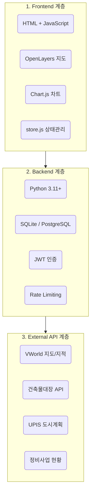

---json
{
  "id": 26,
  "title": "SOP 06: 정비사업 통합검토보고서 플랫폼 — 구축 교육 가이드",
  "category": "🏗️ 플랫폼 개발 (개발자/DX)",
  "level": 3,
  "is_internal": false,
  "date": "2026-07-18",
  "summary": "정비사업 통합검토보고서 자동화 플랫폼의 7단계 워크플로우(구역설정→노후도분석→사업방식비교→변수입력→대안비교→법규검증→보고서생성), 공공API 연동, SQLite DB 스키마, 보안 체크리스트",
  "track": "system"
}
---

# 정비사업 통합검토보고서플랫폼 구축 교육 가이드

## 목차

## 왜 이 시스템이 필요한가?

정비사업 검토 업무의 현재 문제점과 자동화 시스템이 가져오는 변화를 설명합니다.

### 1.1 현행 업무의 비효율

| 현행 방식 | 문제점 | 소요 시간 |
|---|---|---|
| 건축물대장 수작업 조회 | 필지별 개별 조회, 오타 위험 | 2~3일 |
| 엑셀 수동 노후도 분석 | 공식 불일치, 버전 혼재 | 1~2일 |
| 법규 해석 인력 의존 | 건축사마다 해석 편차 | 1일 |
| 워드/PPT 보고서 작성 | 디자인 불일치, 버전 관리 불가 | 2~3일 |
| 합계 |  | 6~9일 |

### 1.2 자동화 시스템의 효과

## 시스템 전체 아키텍처

3계층 구조(프론트엔드 · 백엔드 · 외부 API)의 데이터 흐름을 이해합니다.

### 2.1 시스템 구성도



### 2.2 기술 스택

| 계층 | 기술 | 선택 이유 |
|---|---|---|
| 프론트엔드 | 순수 HTML + JavaScript (SPA) | 빌드 불필요, 즉시 배포 |
| 상태 관리 | localStorage + store.js | 서버 없이 데이터 유지 |
| 지도 | OpenLayers + VWorld WMTS | 국토부 공식 지도, 무료 |
| 차트 | Chart.js | 경량, 반응형 |
| 백엔드 | FastAPI (Python 3.11+) | 비동기, 자동 문서화 |
| DB | SQLite → PostgreSQL | 무설치 → 확장 가능 |
| 배포 | Docker + Nginx | 원클릭 배포 |

### 2.3 프로젝트 폴더 구조

```
정비사업통합보고서/
├── 03_웹_프로토타입/          ← 프론트엔드 (SPA)
│   ├── index.html             ← 메인 진입점 (스테퍼 내비게이션)
│   ├── slides/                ← Step 1~7 각 페이지
│   │   ├── 01-step1-vworld.html
│   │   ├── 02-step2-market.html
│   │   ├── 04-step4-variables.html
│   │   ├── 06-step6-law-check.html
│   │   └── 07-step7-report.html
│   ├── assets/js/
│   │   ├── store.js           ← 전역 상태 관리
│   │   ├── config.js          ← API 키 (⚠️ Git 제외)
│   │   └── shared_utils.js    ← 공통 유틸리티
│   ├── api_server.py          ← FastAPI 서버
│   └── data/building.sqlite   ← 로컬 DB
├── tests/                     ← 테스트 코드
├── Dockerfile
├── docker-compose.yml
└── .env.example
```

## 사전 준비 및 환경 구성

프로젝트를 시작하기 전에 필요한 소프트웨어와 API 키를 준비합니다.

### 3.1 필수 소프트웨어

| 소프트웨어 | 버전 | 용도 | 설치 명령 |
|---|---|---|---|
| Python | 3.11+ | 백엔드 서버 | brew install python@3.11 |
| Node.js | 18+ (선택) | 빌드 도구 | brew install node |
| Docker | 24+ | 컨테이너 배포 | docker.com 다운로드 |
| Git | 2.40+ | 버전 관리 | brew install git |

### 3.2 공공 API 키 발급

| API | 발급처 | URL | 일 호출 제한 |
|---|---|---|---|
| VWorld 지도 | 국토교통부 | www.vworld.kr | 30,000회 |
| 건축물대장 | 공공데이터포털 | www.data.go.kr | 10,000회 |
| UPIS 도시계획 | 서울시 열린데이터 | data.seoul.go.kr | 10,000회 |

### 3.3 프로젝트 초기화

```
# 1. 프로젝트 폴더 생성
mkdir 정비사업통합보고서 && cd 정비사업통합보고서

# 2. Python 가상환경 설정
python3.11 -m venv .venv
source .venv/bin/activate

# 3. 의존성 설치
pip install fastapi uvicorn httpx aiofiles python-jose pydantic

# 4. 환경 변수 파일 생성
cat > .env << 'EOF'
VWORLD_API_KEY=여기에_VWorld_API_키_입력
BUILDING_API_KEY=여기에_건축물대장_API_키_입력
JWT_SECRET=최소32자리_랜덤_문자열_생성
EOF

# 5. 개발 서버 실행
uvicorn api_server:app --reload --port 8000
```

## 7단계 워크플로우 상세

각 단계의 기능, 데이터 흐름, 핵심 코드를 설명합니다.

### 전체 흐름도

### Step 1: 구역 설정 (VWorld 지도)

목적: 정비사업 대상 구역의 경계를 지도 위에 설정하고, 구역 내 필지·도로·시설물 정보를 자동 수집합니다.

| 기능 | 구현 기술 | 데이터 소스 |
|---|---|---|
| 지도 표시 | OpenLayers + VWorld WMTS | VWorld 배경지도 |
| 구역 경계 그리기 | OpenLayers Draw Interaction | 사용자 입력 |
| 지적도 오버레이 | VWorld WMS 레이어 | VWorld 지적편집도 |
| 주소 검색 | VWorld Geocoder API | VWorld 주소 검색 |
| 구역 면적 계산 | Turf.jsturf.area() | 도형 좌표 |

### Step 2: 현황 분석 (노후도 판정)

목적: 구역 내 모든 건축물의 대장 정보를 조회하고, 구조별 노후도를 자동 판정합니다.

| 구조 유형 | 기준년수 | 판정 예시 |
|---|---|---|
| 철근콘크리트조 / SRC | 40년 | 1985년 승인 → 41년 경과 → 🔴 노후 |
| 철골조 | 30년 | 1998년 승인 → 28년 경과 → 🟡 경고 |
| 조적조 / 벽돌조 | 20년 | 2010년 승인 → 16년 경과 → 🟠 주의 |
| 목구조 / 한옥 | 20년 | 2020년 승인 → 6년 경과 → 🟢 양호 |
| 기타 | 20년 | — |

### Step 3: 사업 방식 비교

| 사업 유형 | 근거 법률 | 최소 면적 | 노후도 | 동의율 |
|---|---|---|---|---|
| 재개발 정비사업 | 도정법 | 10,000㎡ | 2/3 이상 | 75% |
| 재건축 정비사업 | 도정법 | — | 안전진단 D | 75% |
| 가로주택정비사업 | 빈축법 | ≤10,000㎡ | 2/3 이상 | 80% |
| 소규모재건축 | 빈축법 | ≤10,000㎡ | 2/3 이상 | 80% |
| 자율주택정비사업 | 빈축법 | ≤1,500㎡ | 2/3 이상 | 전원합의 |
| 모아타운 | 서울시 조례 | 블록 단위 | 2/3 이상 | 80% |

### Step 4: 변수 입력 — 핵심 공식

### Step 5: 대안 비교 — 비례율

### Step 6: 법규 검증 (자동 16항목)

| # | 검증 항목 | 근거 법령 | 유형 |
|---|---|---|---|
| 1 | 용적률 상한 초과 | 국토계획법 §78 | 🤖 자동 |
| 2 | 건폐율 상한 초과 | 국토계획법 §77 | 🤖 자동 |
| 3 | 노후도 2/3 충족 | 도정법 시행령 §2 | 🤖 자동 |
| 4 | 최소 구역 면적 | 도정법/빈축법 | 🤖 자동 |
| 5 | 주차대수 충족 | 주건기준 §27 | 🤖 자동 |
| 6 | 인접 도로 폭원 | 건축법 §44 | 🤖 자동 |
| 7 | 일조권 사선제한 | 건축법 §61 | 👤 수동 |
| 8 | 교육환경영향평가 | 교육환경보호법 | 👤 수동 |
| 9 | 종교시설 제척 | 도정법 §35 | 👤 수동 |
| 10 | 임대주택 의무비율 | 도정법 §54 | 🤖 자동 |

### Step 7: 보고서 생성 (15페이지)

| 페이지 | 내용 | 데이터 소스 |
|---|---|---|
| 1 | 표지 (사업명, 일자, 작성자) | 사용자 입력 |
| 2 | 사업 개요 및 위치도 | Step 1 구역 |
| 3~4 | 건축물 현황 및 노후도 | Step 2 분석 |
| 5 | 사업 방식 비교표 | Step 3 비교 |
| 6~7 | 건축 개요 (용적률, 세대) | Step 4 변수 |
| 8~9 | 대안 비교 분석 | Step 5 시뮬레이션 |
| 10~11 | 법규 검증 결과표 | Step 6 검증 |
| 12 | 수익성 분석 (비례율) | Step 5 계산 |
| 13 | 건축사 종합 의견 | 수동 작성 |
| 14~15 | 면책 조항 + 부록 | 고정 문구 |

## 데이터 소스 및 공공 API

시스템에 필요한 공공 데이터와 API 호출 방법을 설명합니다.

### 5.1 필수 데이터 수집 목록

| # | 데이터 | API / 소스 | 용도 |
|---|---|---|---|
| 1 | 건축물대장 총괄표제부 | data.go.kr API | 대지면적, 건폐율, 용적률 |
| 2 | 건축물대장 동별표제부 | data.go.kr API | 구조, 사용승인일 → 노후도 |
| 3 | 지적도 | VWorld WMS | 필지 경계 시각화 |
| 4 | 도시계획정보 | UPIS / 토지이음 | 용도지역, 지구단위계획 |
| 5 | 정비사업 현황 | 클린업 / 정비포털 | 인접 구역 현황 |
| 6 | 질의회신 DB | 국토부 법령해석 | FAQ 검색 |

### 5.2 SQLite DB 스키마 (핵심 3개 테이블)

```
-- 건축물대장 총괄표제부
CREATE TABLE building_recap (
    id INTEGER PRIMARY KEY,
    대지위치 TEXT NOT NULL,
    대지면적 REAL,  건폐율 REAL,  용적률 REAL,
    주용도 TEXT,    주구조 TEXT
);

-- 건축물대장 동별표제부 (노후도 판정용)
CREATE TABLE building_title (
    id INTEGER PRIMARY KEY,
    대지위치 TEXT NOT NULL,
    구조 TEXT,      사용승인일 TEXT,
    주용도 TEXT,    "연면적(㎡)" REAL
);

-- 정비사업 현황
CREATE TABLE redev_status (
    id INTEGER PRIMARY KEY,
    자치구 TEXT,    구역명 TEXT,
    사업유형 TEXT,  시행단계 TEXT,
    면적 REAL
);
```

## 법규 지식 베이스 구축

### 6.1 필수 법령 12종

| # | 법령 | 약칭 | 핵심 조항 |
|---|---|---|---|
| 1 | 도시 및 주거환경 정비법 | 도정법 | §2, §16, §35, §54 |
| 2 | 도정법 시행령 | — | §2(노후기준), §10(면적) |
| 3 | 빈집 및 소규모주택 정비 특례법 | 빈축법 | §2, §23, §44 |
| 4 | 국토의 계획 및 이용에 관한 법률 | 국토계획법 | §77(건폐), §78(용적) |
| 5 | 건축법 | — | §44(도로), §56(높이), §61(일조) |
| 6 | 주택건설기준 등에 관한 규정 | 주건기준 | §27(주차), §35(소형) |
| 7 | 교육환경 보호에 관한 법률 | 교보법 | §6, §8 |
| 8 | 서울시 정비 조례 | — | 종상향, 임대비율 |

## 보안 및 품질 체크리스트

상용화 전 반드시 확인해야 할 보안 항목 16개와 법무 요구사항입니다.

### 9.1 보안 필수 항목

| # | 항목 | 조치 | 우선도 |
|---|---|---|---|
| 1 | SQL 인젝션 방지 | 모든 쿼리파라미터 바인딩 | 필수 |
| 2 | XSS 방지 | innerHTML대신textContent | 필수 |
| 3 | API 키 보호 | 서버 프록시 경유,.gitignore등록 | 필수 |
| 4 | CORS 제한 | allow_origins=["*"]절대 금지 | 필수 |
| 5 | JWT 인증 | 민감 API에Depends(verify_token) | 권장 |
| 6 | Rate Limiting | IP당 분당 60회 제한 | 권장 |
| 7 | HTTPS | Let's Encrypt 인증서 | 필수 |
| 8 | .env 관리 | .env.example만 커밋 | 필수 |
| 9 | 비root Docker | USER appuser실행 | 권장 |
| 10 | AI 면책 | 모든 페이지에 "법적 효력 없음" 문구 | 필수 |

### 9.2 법무 필수 사항

## AI 에이전트 활용 가이드

아래 프롬프트를 AI 코딩 에이전트에 복사하여 핵심 기능을 빠르게 구현하세요.

### 프롬프트 1: 노후도 판정 함수

### 프롬프트 2: VWorld 지도 초기화

### 프롬프트 3: 법규 검증 엔진

### 프롬프트 4: 보고서 PDF 생성

## 용어 해설

| 용어 | 설명 |
|---|---|
| SPA | Single Page Application. 하나의 HTML 페이지에서 콘텐츠를 동적으로 교체하는 웹 앱 구조 |
| FastAPI | Python 기반 고성능 웹 프레임워크. 비동기(async) 지원, 자동 Swagger 문서 생성 |
| SQLite | 서버 없이 파일 하나로 동작하는 경량 데이터베이스. 설치 불필요 |
| JWT | JSON Web Token. 서버에 세션을 저장하지 않고 토큰으로 인증하는 방식 |
| CORS | Cross-Origin Resource Sharing. 다른 도메인에서의 API 호출을 허용/차단하는 보안 정책 |
| SSOT | Single Source of Truth. 동일한 로직/데이터는 한 곳에서만 관리하는 원칙 |
| VWorld | 국토교통부가 운영하는 공간정보 오픈 플랫폼. 지도, 지적, 주소 API 제공 |
| 도정법 | 도시 및 주거환경 정비법. 재개발·재건축의 근거 법률 |
| 빈축법 | 빈집 및 소규모주택 정비에 관한 특례법. 가로주택·모아타운의 근거 법률 |
| 용적률 | Floor Area Ratio (FAR). 대지면적 대비 건축물 연면적의 비율 |
| 건폐율 | Building Coverage Ratio (BCR). 대지면적 대비 건축면적의 비율 |
| 비례율 | 정비사업의 수익성 지표. 100% 이상이면 조합원 추가 부담 없음 |
| 기부채납 | 공공시설(도로, 공원 등)을 지자체에 무상 기부. 용적률 인센티브와 교환 |
| 종상향 | 용도지역을 한 단계 올리는 것 (예: 2종→3종). 용적률 상한 증가 |
| 프록시 | Proxy. 클라이언트와 서버 사이 중계 서버. API 키 보호에 사용 |
| 파라미터 바인딩 | SQL 쿼리에 변수를 ? 플레이스홀더로 전달하여 인젝션을 방지하는 기법 |

<div class="next-doc-card">
    <!-- NEXT_READ_SECTION -->
    <h4 class="next-doc-title">🧭 다음 읽을 문서</h4>
    <ul class="next-doc-list">
        <li><a href="page_9.html">문서 9. 통합 사업성 검토 플랫폼 활용 가이드</a></li><li><a href="page_24.html">SOP 04: DocReviewPlatform 개발 교육 매뉴얼 — 건축 문서 통합 관리 플랫폼</a></li>
    </ul>
</div>
